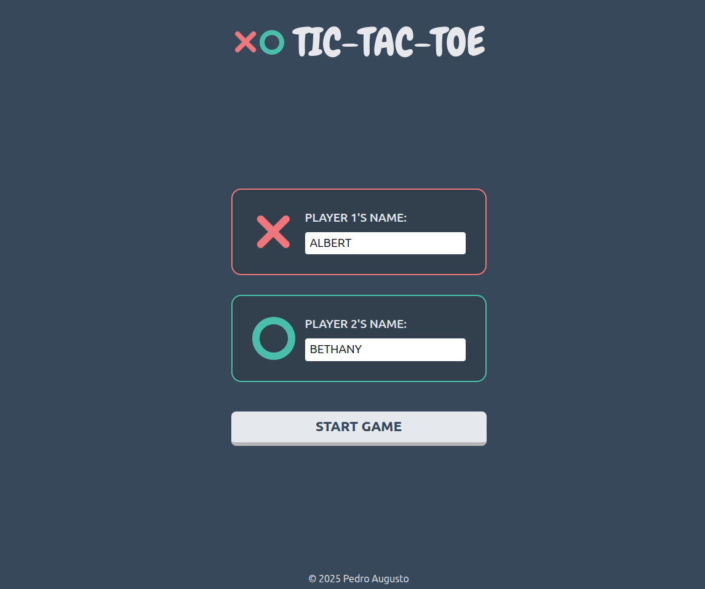
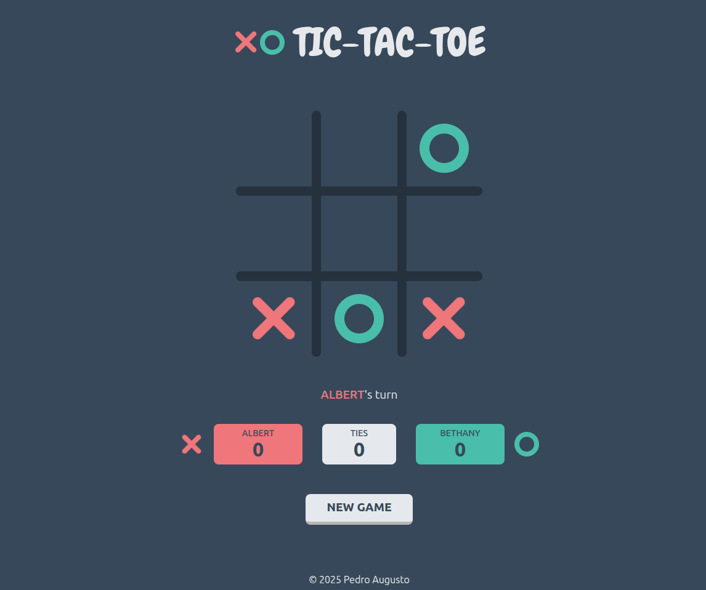
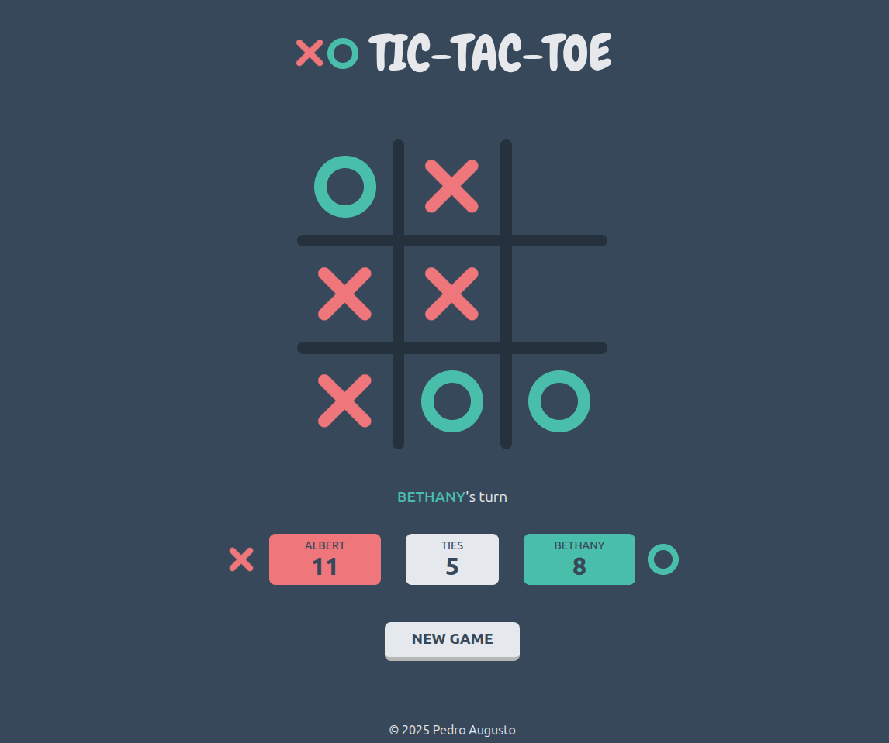

# Tic-Tac-Toe

## Description

- It's a tic-tac-toe game built with HTML, CSS and JavaScript. It's possible to choose custom names for the players and it has a scoreboard that displays each player's score and ties.
- **Features:**
    - JavaScript’s factory functions
    - A grid-based interactive gameboard
    - Form-based page to enter custom player names

## Live Demo

**[Click here](https://pedroasb.github.io/tic-tac-toe/)** to try out this project on browser.

## Screenshots

## About the Project

This project is part of the curriculum of [The Odin Project](https://www.theodinproject.com/). You can check out other projects that I've built in my [fullstack-journey](https://github.com/PedroASB/fullstack-journey) repository.
